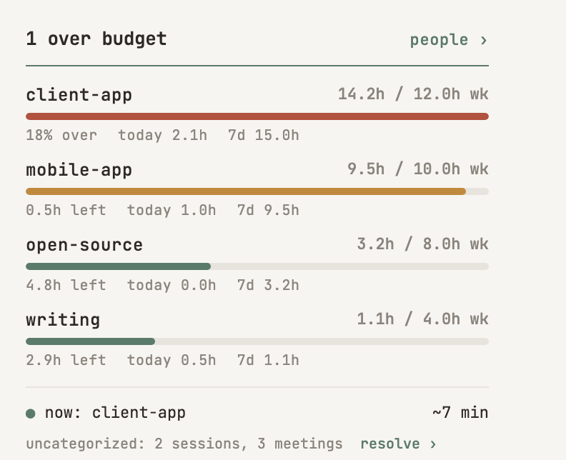

# Pulse

<p align="center">
  
</p>

<h2 align="center">Know where your time actually went.</h2>

If you work through Claude Code all day across more than one project, you have no
honest idea how much time each one got. Session length lies. Your starting folder
lies. Running three sessions at once lies. And the hour you spent in a meeting never
shows up at all. Pulse counts it right and puts it in your menu bar.

## Why this is hard

Measuring how your time splits across projects inside Claude Code looks trivial and
isn't. Every easy way to count it is wrong in a specific way:

- **Session length isn't work time.** You opened a tab at 9:00 and came back at 9:25.
  That's not 25 minutes of work. Pulse counts only the time your fingers were actually
  moving.
- **Turn count isn't signal.** Raw turns include noise, retries, and thinking out loud.
  Pulse measures real activity, not a turn tally.
- **Where you started isn't where the work went.** Start a session in one project's
  folder but do the work for another, and naive tracking counts it to the wrong one.
  Pulse attributes time by where the files actually landed.
- **Concurrency double-counts.** Three sessions at once isn't three times the hours.
  Pulse splits overlapping time so a minute is only ever counted once.
- **Meetings are invisible.** The hour on a call never lands in any log. Pulse folds in
  your calendar, and learns which people belong to which project so it attributes them
  automatically.

So the split is honest, whether you're billing clients, dividing time across your own
products, or just want to know where the day went.

<!-- RECENT:START -->
## What's New

**0.2.1** — 2026-07-08
- _Fixed:_ Nested group cards indent as a whole — border, title, bar, and sub-line shift together by depth — so hierarchy reads as containment instead of a floating title (#50).
- _Fixed:_ Update banner no longer shows a false "update available" on an up-to-date clone: if local HEAD changed since the last check and mismatches the 6h-cached remote sha (the user pulled past a stale cache), the check refreshes the remote before deciding instead of trusting the cache — a genuinely-behind clone still never refetches per-snapshot (#49).

**0.2.0** — 2026-07-08
- _Added:_ Income-meter engagement flavor: `bill_rate: <$/hr>` in `appetite.yaml` meters cumulative dollars billed for the calendar month (`$ = month-to-date hours × rate`) instead of dividing a dollar value into an hour cap. `bill_rate` alone is a pure running meter (`$6,250 mo`, no bar); adding `monthly_cap_value: <$>` shows progress toward the ceiling with `$X left` / `OVER $X`, mirroring hour caps. The meter is monthly (resets on the 1st, matching invoicing); day/week rows keep hours. Mixing income-mode with the hour-cap vocabularies (`monthly_value`/`target_rate`/`weekly_hours`) — or a `monthly_cap_value` with no `bill_rate` — is a loud preflight error, never a silent miscount (#38).
- _Added:_ Panel period toggle gains a third `day` segment (day · week · month) — clicking `day` switches every engagement/group row to today's hours. A day has no cap, so day rows render track-style (hours, no bar) and the choice persists across panel reopens like week/month (#39).
- _Added:_ Classifier: exact launch-dir → bucket fallback (`session_launch_dir_exact` in the rules file), so an umbrella root can be mapped to a bucket without its subdirectories inheriting the mapping (#40).
- _Added:_ Nested groups: a group's `members` in `appetite.yaml` may now name other groups as well as engagements, so groups ladder up into a hierarchy (no new field — the tree reads top-down). The menu-bar card and panel render the nesting indented with correct rollup totals at each level; a group with no `weekly_hours`/`monthly_hours` is a capless roll-up (summed hours, no bar). Bucket splits are documented as a registry `children:` convention (each child's `source_path` a subpath of its parent). Config validation fails loudly — unknown group member, membership cycle, a nesting that double-counts an engagement (reachable via a group and its ancestor), or a registry child path outside its parent — instead of silently miscounting. An engagement reachable via multiple paths is counted once (#31).
- _Added:_ "Update available" banner on the menu-bar card when the installed clone is behind `shanerconsulting/pulse` main — shows the exact one-line update command (`git pull && bash install-mac.sh`) with a copy button. Detection compares local HEAD to the remote main sha via the public GitHub API (stdlib urllib, no auth); it runs on the snapshot tick, is throttled (a real request at most every 6h, cached in `state.json`), and is fully fail-silent — offline or GitHub-unreachable shows nothing and never blocks the card. Only git shas cross the wire; when the clone is current the card stays silent (#25).
- _Changed:_ Session scan keeps an incremental parse cache so unchanged JSONL files (same path+mtime+size) skip re-reading every refresh cycle. The expensive per-file read is cached under the gitignored `.cache/`; the rolling 30d window is re-applied cheaply each run, so output is byte-identical to the uncached path. Measured ~2.9x faster on a warm cache (#30).

**0.1.0** — 2026-06-29
- _Added:_ First public release of Pulse: a local macOS menu-bar app that measures billable time across projects from Claude Code session activity.
- _Added:_ Calendar meetings folded into the time totals — resolved meetings count toward the hour bars and appetite caps, attributed by attendee.
- _Added:_ User-defined roll-up groups with a week/month toggle on the menu-bar card.
- _Added:_ Standalone install: the pipeline runs from a fresh clone with no external checkout, building a repo-local `.venv` the LaunchAgent shares.
- _Fixed:_ Refresh pipeline no longer silently jams under load — snapshot timeouts kill the process group and surface staleness instead of freezing the card (#28).
- _Fixed:_ Calendar dependencies are pinned in `requirements.txt`, so meetings no longer silently fail to count after install (#26).

_Full history in [CHANGELOG.md](CHANGELOG.md)._
<!-- RECENT:END -->

## Everything stays local

Pulse reads files already on your disk and writes one `state.json` next to itself. No
cloud, no account, no telemetry. Your session logs never leave your machine.

## Claude sets it up

You don't configure it. Clone the repo (somewhere **outside** `~/Documents`, `~/Desktop`,
`~/Downloads`, and iCloud Drive — macOS TCC blocks the background app from reading those, so it
would crash-loop; `~/pulse` or `~/dev/pulse` is fine), open it in Claude Code, and paste:

> Read `setup/SKILL.md` and set up Pulse for me.

It discovers your paths, asks for your categories and budgets, writes your config, and
starts the menu bar app.

macOS gets the designed panel (a menu-bar card). Windows runs an always-on-top overlay.

<details>
<summary>Manual setup (without Claude Code)</summary>

1. `cp examples/config.example.yaml config.yaml` and edit the machine values (timezone, projects_dirs).
2. `cp examples/bucket-registry.example.yaml bucket-registry.yaml` and map your repo roots to categories.
3. `cp examples/appetite.example.yaml appetite.yaml` and set per-category hour budgets (or rates).
4. **macOS:** `bash install-mac.sh` — builds a repo-local `.venv` from the system
   `python3` with the pinned deps (rumps, pyyaml, pyobjc; WebKit powers the popover) and
   registers the LaunchAgent. Verify with `.venv/bin/python3 src/pulse/snapshot.py`.
   **Windows:** `pip install pyyaml`, `python3 src/pulse/snapshot.py` to verify, then `install.ps1`.
   (Clone outside `~/Documents` / `~/Desktop` / `~/Downloads` / iCloud Drive / `~/Library/CloudStorage` —
   `install-mac.sh` refuses those, as macOS TCC blocks the LaunchAgent from reading them. Run
   `bash install-mac.sh --check` to preflight a location without installing.)

</details>

## How it works

A deterministic pipeline, no LLM in the hot path: scan sessions, categorize
(`timecore`), compute per-project hours against your budgets, render the menu-bar card
from the resulting `state.json`. The repo is self-contained: `timecore`,
`scan_sessions`, and `prematch` are vendored.

## Splitting buckets & nesting groups

Two hand-edited YAML conventions let you reshape how time rolls up. Both are validated
at snapshot time — a bad edit fails loudly with a clear message instead of silently
miscounting.

**Split a bucket** (in `bucket-registry.yaml`) — carve a sub-folder out of a catch-all
category into its own bucket by adding a `children:` list. Each child gets its own
`source_path`, which **must be a subpath of its parent's** (deepest match wins, so work
under the child path lands in the child and the rest stays in the parent). The engine
already rolls child minutes up into the parent, so the parent keeps aggregating.

```yaml
buckets:
  - name: Personal
    source_path: /Users/you/personal
    children:
      - name: PulseWork
        source_path: /Users/you/personal/pulse   # must live under the parent path
```

**Nest groups** (in `appetite.yaml`) — a group's `members` list may name **other groups**
as well as engagements, so groups ladder up into a hierarchy. No new field; the tree reads
top-down. A group with a cap (`weekly_hours`/`monthly_hours`) shows a bar; a capless group
is a pure roll-up (summed hours, no bar). The menu-bar card and panel render the nesting
indented, with correct rollup totals at each level.

```yaml
groups:
  Billable:
    members: [ClientA, ClientB, ClientC]   # engagements
    weekly_hours: 32
  "Personal Software":                     # capless roll-up (no bar)
    members: [ProjectX, ProjectY]
  "All Work":                              # members name GROUPS -> nesting
    members: ["Billable", "Personal Software", Leftover]
    weekly_hours: 40
```

An engagement reachable via more than one path is counted **once**. The snapshot rejects,
loudly: an unknown member, a membership cycle, a nesting that double-counts an engagement
(reachable via a group and that group's ancestor), and a registry child whose `source_path`
is not under its parent.
